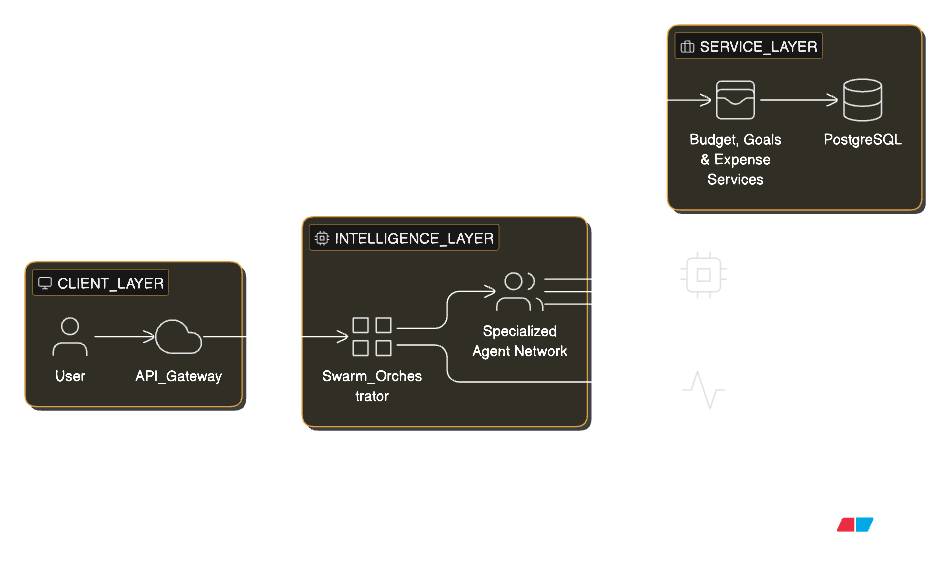

# Fiscal Guard

**Prevent Buyer's Remorse Before It Happens**

## 🎯 What is Fiscal Guard?

Fiscal Guard is an AI-powered financial decision assistant that helps you make smarter purchasing decisions by analyzing your budget, goals, and spending patterns **before** you buy.

Unlike traditional budgeting apps that show you what you overspent _after the fact_, Fiscal Guard intervenes at the moment of decision with personalized insights powered by a **Multi-Agent System** (Strands + Gemini 2.5) and **Real-Time Observability** (Opik).

### The Problem

For people with long-term financial goals—whether saving for a home, building retirement security, or achieving financial independence—impulse spending is a silent saboteur. Americans spend an average of $3,381 annually on [impulse purchases](https://capitaloneshopping.com/research/impulse-buying-statistics/), with around 64% regretting these [decisions](https://youngfinances.com/psychology-of-impulse-spending-explained/). Even more concerning, 32% of consumers have delayed a major financial milestone due to impulse [buying](https://clarifycapital.com/financial-regrets-report).

Traditional budgeting tools are passive—they show you the damage after the money is gone. But impulse purchases happen in a split second, driven by emotion, not logic. By the time you check your budget app, the opportunity to make a better choice has already passed.

### Our Solution

**Active intervention at the moment of decision:** Before you buy, chat with an AI financial guide that knows your goals, budget, and spending patterns. The agent adopts a persona matched to your preferences (e.g., "Financial Monk", etc.) and your strictness settings, providing real-time guidance that checks:

- Your current budget status
- Progress toward your long-term goals
- Your emotional spending triggers and history

Instead of learning about your mistake tomorrow, get the insight you need today—right when it matters most.

## ✨ Key Features

### 🛡️ Shield (AI Chat)

Real-time purchase guidance powered by AI analysis.

- **Smart Analysis**: Checks your budget, goals, spending patterns, and emotional triggers before you buy
- **Adaptive Personas**: Choose your guide — Gentle, Balanced, or Financial Monk

### 📊 Command (Dashboard)

Your financial discipline HQ.

- **Guard Score**: Live discipline rating (0-100) based on recent decisions
- **Trend Analysis**: Visualize decision quality over time with danger zone alerts
- **Budget Health**: At-a-glance category spending

### 🧠 Insights (Regret Tracker)

Learn from past purchases.

- **Feedback Loop**: Rate your purchase satisfaction to train the AI
- **Pattern Recognition**: Surface triggers like _"You often regret clothing over $100"_
- **Progress Tracking**: Watch your impulse control improve

### 🏦 Vault (Finance Hub)

Traditional tracking meets AI-powered chat.

- **Dual Input**: Log expenses via forms or natural language chat
- **Goal Management**: Track progress and contribute with one click
- **Budget Oversight**: Category-based limits with visual indicators

### 🔒 Security & Observability

- **Dual Auth**: Google OAuth + Email/Password (Bcrypt)
- **Full Tracing**: Opik integration with automatic PII redaction
- **Privacy-First**: Sensitive data never leaves trace logs

## 🏗️ Architecture

**Multi-agent system with real-time observability and privacy-first design.**

## 🎯 Try It Live

👉 **[Demo Link](https://fiscal-guard.vercel.app)**

## 🏆 Tech Stack

- **AI Agent**: Google Gemini 2.5 Flash with Strands orchestration
- **Backend**: FastAPI + PostgreSQL
- **Frontend**: React + Shadcn UI
- **Observability**: Opik for LLM tracing & evaluation
